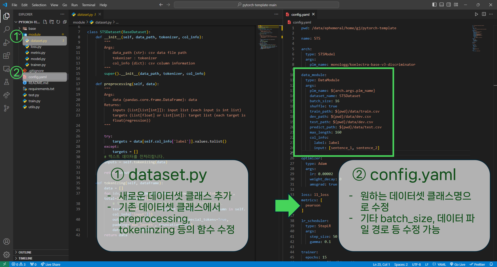
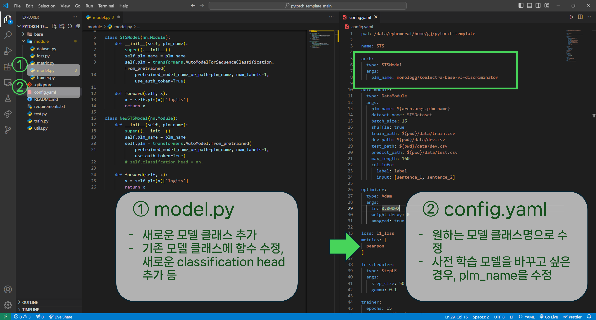
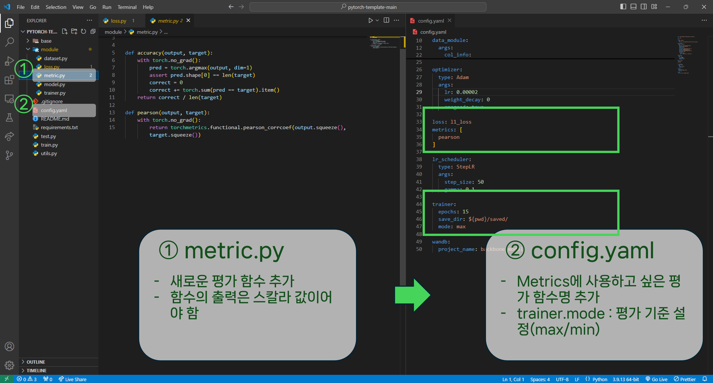

안녕하세요, **NLP-11조 세븐일레븐**입니다.

저희 팀의 템플릿도 소개 드려 보려고 합니다. 😊

저희는 여러 가지 모델, 전처리 방식, 하이퍼파라미터 등을 조합하여 다양하게 실험해보는 것이 중요하다고 생각했습니다. 이 작업을 최대한 효율적으로 하기 위해서, 모델, 데이터셋, 손실함수 등 학습 구성 요소들을 모듈화하여 수정이 필요한 부분 외 다른 코드는 그대로 유지할 수 있도록 템플릿을 제작하였습니다. 각 모델, 데이터셋 등은 클래스화하여 관리하며 `config.yaml` 파일을 이용해 학습, 예측 시에 인자로 전달함으로써 다양한 조합의 모델링 실험을 효율적으로 진행할 수 있습니다.

(본 템플릿은 [victoresque 템플릿](https://github.com/victoresque/pytorch-template)을 바탕으로 저희 프로젝트에 적합하게 재구성하였습니다.)

# Demo

[유튜브 영상 링크](https://www.youtube.com/watch?v=jgXu96txl6I)

# get started

1. `config.yaml` 파일에서 `pwd`값을 현재 위치하신 디렉토리 위치로 바꿔주셔야 합니다. `pwd`(현재 디렉토리의 경로를 출력하는 cli 명령어)로 쉽게 찾으실 수 있습니다.
2. 데이터 폴더를 템플릿 디렉토리 안으로 넣으셔야 합니다. 이때, 데이터 폴더 이름은 *data*로 해주시면 좋습니다.
3. **Hugging Face CLI** (Command Line Interface)에 로그인해 주셔야 합니다. `huggingface-cli login` 명령어를 실행한 다음 api-token을 입력해주시면 됩니다.
4. wandb를 사용할 경우 `config.yaml` 파일에서, `wandb.project_name`을 적절히 설정해야 합니다.

## How to use

모델, 데이터셋, 평가 메트릭 등을 커스텀하고 싶은 경우, `module` 폴더 내 해당 파일에서 새로 클래스를 만들거나, 기존 클래스를 수정할 수 있습니다.

### 0. setting hyper-parameter

`batch_size`, `learning_rate` 등 하이퍼 파라미터를 수정하고 싶은 경우, `config.yaml` 파일에서 해당 하이퍼 파라미터 값을 원하는 대로 변경하시면 됩니다.

```yaml
pwd: /data/ephemeral/home/pytorch-template

name: STS

arch:
  type: STSModel
  args: 
    plm_name: monologg/koelectra-base-v3-discriminator

data_module:
  type: DataModule
  args:
    plm_name: ${arch.args.plm_name}
    dataset_name: STSDataset
    batch_size: 16
    shuffle: true
    ...
    max_length: 160
    col_info:
      label: label
      input: [sentence_1, sentence_2]

optimizer:
  type: Adam
  args:
    lr: 0.00002
    weight_decay: 0
    amsgrad: true

loss: l1_loss
metrics: [
  pearson
]
```

### 1. customizing dataset

1. `module/dataset.py`에서 `BaseDataset`을 상속 받은 클래스를 선언합니다.

2. 해당 클래스에 `preprocessing` 함수를 구현합니다. 이때, 입력값은 `pandas.core.frame.DataFrame` 객체가 되어야 하고, 출력값은 `(inputs, targets)`으로, `(List[List[int]], List[int or long])` 형태가 되어야 합니다.

3. 마지막으로, `config.yaml` 파일에서 `data_module.args.dataset_name`값을 "해당 클래스 이름"(e.g., `STSDataset`)으로 변경합니다.

### 2. customizing model

1. `module/model.py`에서 `nn.Module`을 상속 받은 PyTorch 모델 클래스를 구현합니다.

2. `config.yaml` 파일에서 `arch.type`값을 "해당 클래스 이름"으로 변경합니다 
참고로, 사전 학습 모델을 변경하고 싶을 경우 `arch.args.plm_name`값을 "원하는 사전 학습 모델 이름"(e.g., `klue/roberta-small`)으로 변경하면 됩니다.

### 3. customizing loss

1. `module/loss.py`에서 손실 함수를 구현합니다. 이때, 손실 함수의 출력값은 스칼라값 이여야 합니다.

2. `config.yaml` 파일에서 `loss`값을 "손실 함수 이름"(e.g., `l2_loss`)으로 변경합니다.

### 4. customizing metrics

1. `module/metric.py`에서 평가 지표 함수를 구현합니다. 이때, 평가 지표 함수의 출력값도 스칼라값 이여야 합니다.

2. `config.yaml` 파일에서 `metrics` 리스트에 "평가 지표 함수 이름"(e.g., `pearson`)을 추가합니다. 참고로, 모델을 저장할 때는 `metrics` 리스트의 첫번째 평가 지표를 사용하며, max/min 기준은 `trainer.mode`에서 설정하시면 됩니다. 그리고, 저장 위치는 `trainer.save_dir`에서 확인할 수 있습니다.

### 추가
- `train.py`를 통해 모델 학습을 진행하면 `saved` 폴더 안에 모델이 저장됩니다.

- `test.py`을 실행하면 train/dev/test dataset에 대한 예측값이 `output` 폴더 안에 저장됩니다. 이때,`checkpoint_path` 변수에 checkpoint 경로를 넣어줘 테스트에 사용되는 모델을 지정해줘야 합니다.

### Template structure

```
pytorch-template
├── base/ 
|   ├── base_data_loader.py
|   ├── base_dataset.py
|	└── base_trainer.py
├── module/   
|   ├── dataset.py        # dataset class 구현
|   ├── loss.py           # loss function 구현
|   ├── matric.py         # matric function 구현
|   ├── trainer.py        # trainer class 
│   └── model.py          # model class 구현
├── config.yaml           # configuration file
├── saved/                # 모델 저장 폴더
├── output/               # 추론 결과 폴더
├── .gitignore
├── README.md               
├── reqirements.txt                            
├── test.py                # 모델 추론
├── train.py               # 모델 학습 및 저장
└── utils.py         
```

글 작성에 많은 도움을 주신 [임상엽_T7427](https://github.com/gityeop), [이재협_T7419](https://github.com/jhyeop) 팀원에게 감사의 말씀을 드립니다.